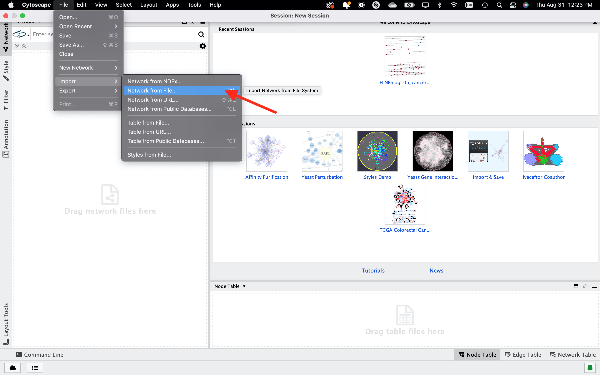
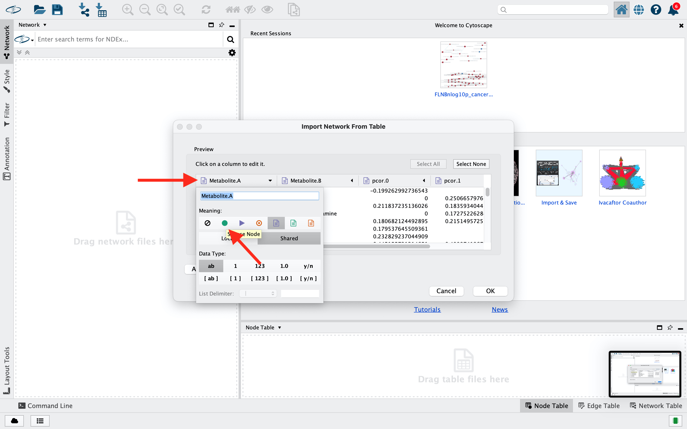
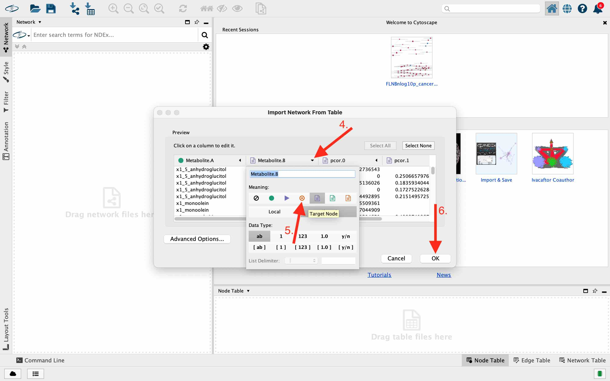
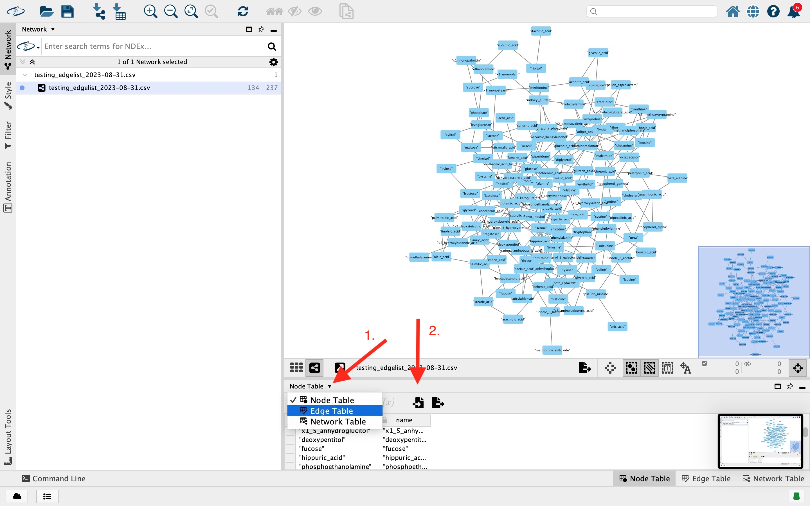
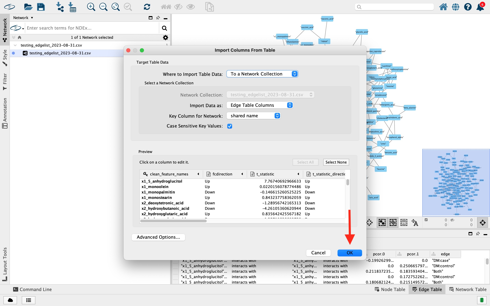

```{r, environment setup, include = FALSE}
knitr::opts_chunk$set(
  collapse = TRUE,
  comment = "#>",
  prompt = TRUE
)

library(dplyr)
library(knitr)
library(kableExtra)
```
# Downloading DNEA
The DNEA R package is currrently available on the [Karnovsky Lab github](https://www.github.com/Karnovsky-Lab/DNEA). Any troubleshooting or issues with the software can be reported there. The package can be installed using devtools. BiocManager is also needed to install several package dependencies stored on Bioconductor. Let's download those packages if necessary, and load them into R.

```{r, install , eval=FALSE}
#install BiocManager if not already
if(!nzchar(system.file(package = "BiocManager"))){
  install.packages("BiocManager")
}

#install devtools if not already
if(!nzchar(system.file(package = "devtools"))){
  install.packages("devtools")
}

#load packages
library(devtools)
library(BiocManager)
```
Now  we can install DNEA and its dependencies.
```{r, install DNEA, eval=FALSE}
#install dependency packages
BiocManager::install(c("BiocParallel","dplyr","gdata","glasso","igraph",
                       "janitor","Matrix","stringr","netgsa"))

#install DNEA
devtools::install_github("Karnovsky-Lab/DNEA")
```
# Basic DNEA workflow
This package is the most customizable implementation of DNEA to date, allowing the user to create the best analysis for their data. This vignette aims to walk you through a typical DNEA workflow, and describe the parameters that may be modified in common use cases.  

## Example Data 
We will use the metabolomics expression data derived from The Environmental Determinants of Type I Diabetes in the Young (TEDDY) clinical trial (@TEDDY) to demonstrate DNEA. TEDDY is a prospective case-control study that seeks to better understand environmental causes of Type I diabetes. High-risk infants, as defined by the presence of HLA-DR and HLA-DQ genotypes, were visited every 6 months and blood samples were collected until development of type I diabetes or their 15 birthday, whichever occurred first. The study consisted of two conditions, Islet auto-antibody (IA) case vs. control and Type I Diabetes (T1D) case vs. control, but we will focus on the latter here. The data was originally accessed from Metaboolomics Workbench under Project ID: [PR000950](https://www.metabolomicsworkbench.org/data/DRCCMetadata.php?Mode=Project&ProjectID=PR000950). The T1D arm contains 3525 samples from 440 subjects, 50 of which developed Type I Diabetes. The example data contains the samples from those 50 subjects on the date of diagnosis as well as samples from the 322 paired control subjects (3 control to 1 case) closest to that day. This data is stored in the package, and instructions on how to access the data are below. Please visit the Metabolomics Workbench for more information about the data set.

## Quick Start
The following code chunk represents a typical DNEA workflow for the example data.
```{r, Quick Start, eval=FALSE, echo = TRUE}
#Load packages
library(DNEA)
library(BiocParallel)
#load the example data
data("TEDDY")
data("T1Dmeta")

#initiate BiocParallel 
BP_plan <- MulticoreParam(workers = 4, RNGseed = 417, progressbar = TRUE)

#re-order the metadata to match the sample order of expression_data
T1Dmeta <- T1Dmeta[colnames(TEDDY),]

#save the group column to be used as group_labels
group_labels <- T1Dmeta$group

#name each element for its corresponding sample
names(group_labels) <- rownames(T1Dmeta)

#convert to factor
group_labels <- factor(group_labels, levels = c("DM:control", "DM:case"))

#Run DNEA
TEDDYdat <- createDNEAobject(project_name = "TEDDYmetabolomics",
                             expression_data = TEDDY,
                             group_labels = group_labels)
TEDDYdat <- BICtune(object = TEDDYdat, informed = TRUE, interval = 1e-3, BPPARAM = BP_plan)
TEDDYdat <- stabilitySelection(object = TEDDYdat, subSample = TRUE, nreps = 1000, BPPARAM = BP_plan,
                               BPOPTIONS=bpoptions(tasks = 8))
TEDDYdat <- getNetworks(object = TEDDYdat, aprox = TRUE, informed = TRUE, interval = 1e-3, BPPARAM = BP_plan)
TEDDYdat <- clusterNet(object = TEDDYdat, tau = 0.5)

TEDDYdat <- runNetGSA(TEDDYdat)

#visualize networks in R
plotNetworks(TEDDYdat, type = "group_networks", subtype = "DM:case", layout_func = layout_nicely,
             label_font = 2, label_size = 0.5, node_size = 7)
plotNetworks(TEDDYdat, type = "subnetworks", subtype = 1, layout_func = layout_nicely,
             label_font = 2, label_size = 0.5, node_size = 7)

#save files for visualization in Cytoscape
getNetworkFiles(TEDDYdat, file_path = getwd())

```

# Input data
There are 3 inputs required to initiate the DNEA workflow: a character string corresponding to the experiment name indicated by `project_name`, the expression data indicated by `expression_data`, and the experimental groups indicated by `group_labels`.  

## expression_data
The `expression_data` should be an *m x n* numeric matrix wherein the metabolites, *m*, (or lipids, proteins, etc.) each have a row, and the samples, *n*, each have a column. DNEA jointly estimates the biological network for each experimental condition using Guassian Graphical Model's (GGM), so it is important that the data for each group is approximately normal. To that end, DNEA log transforms and auto-scales the expression data for each group independent of the other when the workflow is initiated. The input should be raw peak intensities/concentrations. Differential expression analysis is an important part of pathway enrichment analysis downstream, and it cannot be performed after the experimental groups have been normalized separately, since the mean expression for each metabolite within the experimental groups is then centered around zero. ***NOTE: It is acceptable to adjust the expression data for batch effect or confounding variables (i.e. age, sex, bmi) prior to analysis.***

Let's load the example data stored inside the DNEA package. It is a numeric expression matrix where the metabolites are in rows and the samples are in columns. The peak intensity data has been adjusted for age and sex to remove those confounding variables, ***but it has not been log-transformed or scaled.***
```{r, load example data, eval=1:5, echo=TRUE}
#first load DNEA into R
library(DNEA)

#load the example data
data("TEDDY")
```
```{r, TEDDY examine echo, eval=FALSE, echo=TRUE}
TEDDY[1:10, 1:4]
```
```{r, TEDDY examine, echo=FALSE}
TEDDY_table <- knitr::kable(TEDDY[1:10, 1:4])
kable_styling(TEDDY_table, "striped", position = "left", full_width = TRUE)

#remove table
rm(TEDDY_table)
```
## group_labels
The `group_labels` should be a vector of factor elements that correspond to the experimental condition of each sample. Each element should be named for its corresponding sample, and the order should match the order of the samples in *expression_data*. We can create the `group_labels` object for the *TEDDY* data using the metadata, *T1Dmeta*, stored in DNEA. Each row is a different sample, and each column is a different variable. We need the experimental conditions for each sample in the "group" column and the names for each sample which are the row names of the data frame. More information about the available metadata can be found in the *T1Dmeta* documentation.
```{r, load example metadata, eval=TRUE}
#load T1Dmeta
data("T1Dmeta")

unique(T1Dmeta$group)
```
```{r, T1Dmeta echo, eval=FALSE, echo=TRUE}
#View the metadata
T1Dmeta[1:10, c(1,5,6,7)]
```
```{r, T1Dmeta examine, echo=FALSE}
T1Dmeta_table <- knitr::kable(T1Dmeta[1:10, c(1,5,6,7)])
kable_styling(T1Dmeta_table, "striped", position = "left", full_width = TRUE)

#remove table
rm(T1Dmeta_table)
```
DNEA is designed to jointly estimate biological networks from only ***TWO*** experimental conditions. If you have one experimental condition, you should consider using another tool we developed, [CorrelationCalculator](http://metscape.ncibi.org/calculator.html), for your analysis. 

Our experimental condition has two possible values: "DM:control" and "DM:case". Now we can re-order the metadata to match the sample order of the expression data, and save the group labels as a new vector element. Finally, we can convert this character vector into factors. We will specify "DM:control" as the reference.
```{r, create group_labels, eval=TRUE}
#re-order the metadata to match the sample order of expression_data
T1Dmeta <- T1Dmeta[colnames(TEDDY),]

#save the group column to be used as group_labels
group_labels <- T1Dmeta$group

#name each element for its corresponding sample
names(group_labels) <- rownames(T1Dmeta)

#convert to factor
group_labels <- factor(group_labels, levels = c("DM:control", "DM:case"))
```

# STEP 1: Data pre-processing and feature aggregation
## Data pre-processing
DNEA is an object-oriented workflow built around a custom s4 object, `DNEAobj`. We provide an initiator function that encompasses several necessary steps to begin DNEA. First, the data is restructured for input into a `DNEAobj` object, and differential expression (DE) analysis is performed on the log-transformed input data. The data is then split by experimental condition and auto-scaled. An eigen decomposition is performed to check the minimum eigenvalue and the condition number of the correlation matrix for the whole data set, as well as each experimental group individually.
```{r, start DNEA, eval=TRUE}
#initiate DNEAobj object
TEDDYdat <- createDNEAobject(project_name = "TEDDYmetabolomics",
                             expression_data = TEDDY,
                             group_labels = group_labels)
```
Eigenvalues close to or below zero, or similarly extremely large condition numbers, represent instability in the data set and triggers a warning that recommends highly correlated metabolites be aggregated into single features prior to analysis. As you can see above, the TEDDY data set has a negative eigenvalue for the "DM:case" experimental group, triggering a warning.

**WHAT CAUSED THIS WARNING?**  

There are a number of reasons that instability may occur within a data set; Highly correlated features is one of the most common causes in expression data. We can view this by plotting a heat map of the pearson correlation matrix for the "DM:case" data. The log-scaled data is accessed using the `expressionData()` function. 
```{r, correlation heatmap, eval=TRUE, message=FALSE}
#load the pheatmap and Hmisc packages
library(pheatmap)
library(Hmisc)

#grab the DM:case data from the DNEAobj object
expr_dat <- expressionData(TEDDYdat, assay = "log-scaled_data")[["DM:case"]]

#create a pearson correlation matrix - data should be transposed first so features are in columns
cor_dat <- Hmisc::rcorr(t(expr_dat), type = "pearson")$r

#cluster the correlations and reorder correlation matrix to better visualize
  dd <- as.dist((1-cor_dat)/2)
  hc <- hclust(dd)
  cor_dat <-cor_dat[hc$order, hc$order]
  
  #create pheatmap
  pheatmap(cor_dat, cluster_rows = FALSE,cluster_cols = FALSE,
         legend = TRUE,annotation_legend = FALSE,
         labels_row = '',labels_col = '',
         main = 'Feature correlations in DM:case group'
)

```

There are pockets of red and blue indicating highly correlated metabolites in this data set that may be causing the instability. More information can be found in the following section, [Feature Aggregation].

Finally, we can view information about our analysis using the built in show function. We can access the differential expression results in the node list using the `nodeList()` function.
```{r, DNEA summary, eval=TRUE, echo=TRUE}
#show summary of DNEAobj object
TEDDYdat
```
```{r, node list examine echo, eval=FALSE, echo=TRUE}
#access node list
nodeList(TEDDYdat)[1:5,]
```
```{r, node list examine, echo=FALSE}
nodelist_table <- knitr::kable(nodeList(TEDDYdat)[1:5,])
kable_styling(nodelist_table, "striped", position = "left", full_width = TRUE)

#remove table
rm(nodelist_table)
```


<div align = "center"><font size="4" color = red> To skip feature aggregation, move on to [STEP 2: Model Tuning]</font></div><br>


## Feature Aggregation
We have implemented an updated node aggregating algorithm similar to the one described in @Filigree2021. The `aggregateFeatures()` function makes available the **correlation-based**, **knowledge-based**, and **hybrid** collapsing methods from Filigree. The main difference being that the user now specifies a pearson correlation threshold by which to collapse features with an absolute correlation above said value. The function then re-runs `createDNEAobject()` to create a `collapsed_DNEAobj` object with the new data.  

**WHY SHOULD WE AGGREGATE?**  

The regularization steps employed in DNEA will correct instability without additional user-intervention, however, it can be desirable to preemptively address this by aggregating highly-correlated metabolites - particularly if the data set contains many features of the same class of compounds (i.e. fatty acids, carnitines, etc.). This gives the user more control over network construction and simplifies the resulting networks.  

GGM's require considerable computational power. Adding additional samples to your data set will have marginal effects on the memory and processing time required for analysis, however, as the number of features grows in your data set the run time will increase dramatically. The ability to parallelize tasks on a high-performance machine (cluster or cloud resource) to perform stability selection helps tremendously with this issue. Even so, a user may still find themselves constrained by the resources available to them. Moreover, the data set may contain many compounds of the same class that are highly correlated, and/or network resolution at the individual molecule level is not needed (i.e. fatty acids that vary by only a few bonds in a lipidomics study). Aggregating highly correlated features retains signal from all of the metabolites, as opposed to regularization arbitrarily choosing one as representation and removing some or all of the correlates. This decreases the complexity of the analysis without losing critical network information. Less compute resources are required for the analysis and the resulting networks are more interpretable.


To perform feature aggregation, we need to provide `aggregateFeatures()` the `DNEAobj` object and a character string corresponding to the desired aggregation method. If the "correlation" or "hybrid" method is chosen, we specify the `correlation_threshold` parameter wherein metabolites with correlations stronger than this threshold are aggregated into a single node. If the "knowledge" or "hybrid" method is chosen, we need to provide a data frame for `feature_groups` to specify the class of each metabolite in our data set. Metabolite aggregation is then performed within each class. More information about the three methods as well as best use cases can be found in the function documentation and in @Filigree2021.  


For demonstration purposes, we are going to use the "hybrid" approach for feature aggregation. The `feature_groups` input should be a data frame with the original metabolite names as the first column and as the row names. The class labels should be in the second column. Independent metabolites can retain their name as its class label. Let's create the `feature_groups` data frame, and group the branched chain amino acids into one class and all other acids into another.
```{r, setup input for aggregateFeatures, eval=TRUE}
#save metabolite names
metab_names <- rownames(expressionData(TEDDYdat, assay = "input_data"))

#create feature_group data.frame
TEDDY_groups <- data.frame(features = metab_names,
                           groups = metab_names,
                           row.names = metab_names)

#create labels
TEDDY_groups$groups[TEDDY_groups$groups %in% c("isoleucine",
                                               "leucine",
                                               "valine")] <- "BCAAs"
TEDDY_groups$groups[grepl("acid",
                          TEDDY_groups$groups)] <- "fatty_acids"


```
```{r, TEDDY groups echo, eval=FALSE, echo=TRUE}
#take a look at the group labels
TEDDY_groups[1:10, ]
```
```{r, node collapse groups, echo=FALSE}
netGSA_table <- knitr::kable(TEDDY_groups[1:10, ])
kable_styling(netGSA_table, "striped", position = "left", full_width = TRUE)
```

For the "hybrid" method we also have to provide a `correlation_threshold` value. The algorithm will only aggregate metabolites within a specified group that have a stronger correlation than the `correlation_threshold` value provided.
```{r, run aggregateFeatures, eval=TRUE}
#perform feature collapsing
collapsed_TEDDY <- aggregateFeatures(object = TEDDYdat,
                                  method = "hybrid",
                                  correlation_threshold = 0.7,
                                  feature_groups = TEDDY_groups)

collapsed_TEDDY
```
We have reduced our total number of features from 134 to 130. To use the aggregated data, we would continue our analysis with the *collapsed_TEDDY* object. However, this data set is a curated list of diverse metabolites, so high correlations are not likely a result of chemical similarity. We do not want to erroneously combine disparate features, so it is better to continue without aggregating. Therefore, we will use the *TEDDYdat* object for the rest of the analysis.

## [OPTIONAL] Custom-Normalized Data Input
The expression data is log transformed and auto-scaled by DNEA upon initiation of the workflow with `createDNEAobject()`. However, varying normalization methods are used for metabolomics and lipidomics data (e.g. auto-scaling, median-scaling, quantile-normalization, RUV2) that may affect correlation-based studies differently. If you have a preferred normalization method, we provide an additional helper function, `addExpressionData()`, to input custom-normalized data into the object for analysis. The user must provide a named list that includes: 

***1.*** **[experimental group 1]**: a matrix that corresponds to the data of the first experimental group 
that was scaled independent of the other experimental group

***2.*** **[experimental group 2]**: a matrix similar to element two for the second experimental group.

***REMEMBER:*** *The intensities/concentrations of each metabolite must be approximately normally distributed*. As an example, let's median-scale the TEDDY data and insert it into the *TEDDYdat* object.
```{r, addExpressionData, eval=TRUE}

#log-transform and transpose the TEDDY data
TEDDY <- t(log(TEDDY))

#make sure metadata and expression data are in same order
T1Dmeta <- T1Dmeta[rownames(TEDDY),]

dat <- list('DM:control' = TEDDY[T1Dmeta$group == "DM:control",],
            'DM:case' = TEDDY[T1Dmeta$group == "DM:case",])

#log-transform and median center the expression data without scaling
newdat <- list()
for(cond in seq(length(dat))){

  group_dat <- dat[[cond]]
  for(i in seq(1, ncol(group_dat))){
    metab_median = median(group_dat[, i], na.rm = TRUE)
    metab_range = range(group_dat[, i], na.rm = TRUE)
    scale_factor = max(abs(metab_range - metab_median))
    group_dat[, i] <- (group_dat[, i] - metab_median) / scale_factor

    rm(metab_median, metab_range, scale_factor)
  }

  group_dat <- group_dat[rownames(dat[[cond]]),colnames(dat[[cond]])]
  group_dat <- t(group_dat)
  newdat <- append(newdat, list(group_dat))

  rm(i, group_dat)
}

#add names
names(newdat) <- names(dat)

#add data
TEDDYdatCustomInput <- addExpressionData(object = TEDDYdat,
                                         dat = newdat,
                                         assay_name="median_scaled_data")
```
This function inserts the provided data into the `scaled_expression_data` list element in the assays slot and moves the log-transformed and auto-scaled expression data created by DNEA to the `DNEA_scaled_data` list element. We are going to proceed with the *TEDDYdat* object and the log-scaled data inherent to DNEA in the next step.

# STEP 2: Model Tuning
Model tuning utilizes two regularization methods: $\lambda$ tuning via Bayesian-information criterion (BIC), and stability selection. This step allows us to analyze data sets with less samples than the number of metabolites and is critical for DNEA. When **the number of samples approaches or exceeds the number of features**, regularization in the model is not strictly necessary and you may proceed without this step. This allows users with very large data sets to create networks from a simplified GGM model. If tuning is not performed and the `optimal_lambda` parameter is not specified, the $\lambda$ value defaults to   

<div align = "center">$\lambda = \sqrt{ \ln (num. features) / num. samples}$</div> 
and all of the selection probabilities are set to 1. However, we highly recommend performing this step irrespective. Regularization adds sparsity to the resulting networks and improves model specificity by removing weak or potentially false positive edges.

## $\lambda$ tuning via BIC
The `BICtune()` function optimizes the $\lambda$ parameter by calculating a BIC score and likelihood value for every tested $\lambda$, as described in @BIC2011. We minimized the necessary computation in this step by optimizing the c constant that describes the asymptotically valid $\lambda$ for smaller data sets, following the equation:

<div align = "center">$\lambda = c \sqrt{ \ln (num. features) / num. samples}$</div> 

The user can also opt to provide a range of $\lambda$ values to test using the `lambda_values` parameter or optimize lambda directly by setting `informed=FALSE`. In our testing, we have been able to reduce the values tested ten-fold by using the informed approach.

Each $\lambda$ value tested can be run embarrassingly parallel using the BiocParallel package. Both `BICtune()` and `stabilitySelection()` have support for parallel computation. We only need to create the workers once and they can be called for each parallel process. Since `stabilitySelection()` uses random number generation to randomly sample the expression data in each replicate, we will have to set the seed now so that the results are reproducible. We will also turn on the progress bar for real time updates.
```{r, BiocParallel, eval=TRUE}
#load in BiocParallel
library(BiocParallel)

#create parallel sockets
BPPARAM <- BiocParallel::SnowParam(workers = 2, RNGseed = 417, progressbar = TRUE)
```

```{r, load processed data, include=FALSE}

#load processed results since 500 reps would take ~28 min
data("dnw")
TEDDYdat <- dnw
rm(dnw)
```
Now that we have our workers set up, we can optimize $\lambda$. If you are performing this step on a high-performance computer, we can silence the progress bar using `BPOPTIONS.`
```{r, BICtune, eval = TRUE, echo = TRUE, strip.white=TRUE}

#optimize lambda
TEDDYdat <- BICtune(TEDDYdat, 
                    informed = TRUE, 
                    interval = 1e-3, 
                    BPPARAM = BPPARAM, 
                    BPOPTIONS = bpoptions(progressbar = FALSE))
```
Our tuned lambda value is 0.05072355. This was selected by minimizing the BIC score. To illustrate BIC optimization, we can plot the BIC scores as a function of $\lambda$
```{r, BIC plot, eval=TRUE}
#load ggplot2
library(ggplot2)
#create data frame of values
BICtuneData <- rbind(data.frame(lambda = unlist(lambdas2Test(TEDDYdat)),
                          value = vapply(BICscores(TEDDYdat), function(x) x$BIC, double(1)),
                          score = rep("BIC", length(lambdas2Test(TEDDYdat)))),
                     data.frame(lambda = unlist(lambdas2Test(TEDDYdat)),
                          value = vapply(BICscores(TEDDYdat), function(x) x$likelihood, double(1)),
                          score = rep("likelihood", length(lambdas2Test(TEDDYdat)))))

#create plot
ggplot(data = BICtuneData, aes(x = lambda, y = value)) + 
  geom_line(aes(linetype = score)) + 
  geom_point(aes(shape = score)) +
  geom_vline(xintercept = optimizedLambda(TEDDYdat), color = "red") +
  ggtitle("BIC and Likelihood Scores with Respect to Lambda")

```

## Stability Selection
The `stabilitySelection()` function calculates selection probabilities, or the estimated probability that an edge is identified in a randomly sampled subset of the input data, using the method outlined in @DNEA2019. The selection probability for each metabolite-metabolite interaction is then used to modify the lambda parameter following the equation:  

<div align = "center">$\rho = \lambda*(1 / (1e-04 + selection.probability))$</div>
To perform stability selection, we need to pass *TEDDYdat* to the `stabilitySelection()` function. We also need to specify the number of replicates to perform with the `nreps` parameter, provide the BiocParallel object we created earlier to `BPPARAM`, and specify whether or not additional sub sampling of the data should be performed with `subSample`. We recommend setting `nreps = 500` when not using the sub-sampling protocol, which is the default value. Stability selection *without* additional sub-sampling randomly samples 50% of each group (without replacement), creating two evenly sampled data sets and fitting a GGM to both. This means that at the default `nreps = 500`, 1000 replicates are actually performed.

When the sample groups are very unbalanced, the selection probabilities from stability selection strongly favor the larger group resulting in unstable edges. We combat this by employing a sub-sampling protocol during stability selection that was first introduced in @Filigree2021 by setting `subSample = TRUE`. This method ensures that each group is equally represented in stability selection. Since nearly all of the data for the smaller group is used *with* additional sub-sampling, only one model is fit per replicate. When utilizing the sub-sampling protocol, `nreps` should be set to 1000.

If you elect to optimize the $\lambda$ parameter using a different method than `BICtune()`, you can specify the value to use with the `optimal_lambda` parameter. Only 50 of our 322 samples are "DM:case", therefore, it is most apropriate to use the subsampling protocol by setting `subSample = TRUE`. In this scenario, we recommend running 1000 replicates by setting `nreps=1000`. This is the most computationally expensive step in the algorithm, and the workflow up to this point takes ~15 minutes using 4 cores on a 2.5 GHz Quad-Core Intel Core i7 processor.

```{r, stabsel show, eval = FALSE, echo = TRUE, strip.white=TRUE}
#perform stability selection
TEDDYdat <- stabilitySelection(TEDDYdat,
                               subSample = TRUE,
                               nreps = 1000,
                               BPPARAM = BPPARAM,
                               BPOPTIONS = bpoptions(progressbar=FALSE))
```
```{r, stabsel message, eval=TRUE, echo=FALSE, strip.white=TRUE}
message('The lambda value stored in the DNEAobj will be used for analysis (this can be ',
            'accessed via the optimizedLambda() function')
message("Using Lambda hyper-parameter: ", optimizedLambda(TEDDYdat), "!\n",
          "stabilitySelection will be performed with 1000 replicates!")
message("Additional sub-sampling will be performed on uneven groups\n")
message("Calculating selection probabilities WITH subsampling for...DM:case...\n")
message("Calculating selection probabilities WITH subsampling for...DM:control...")
```
# Step 3: Constructing the Networks and Consensus Clustering
Now that we have optimized the input parameters, we can jointly estimate the biological networks. We will construct a glasso model to calculate the partial correlation value for each metabolite-metabolite interaction. We can then perform consensus clustering to identify metabolic modules, or sub networks, within the larger experimental group networks.

## Constructing the Networks
We provide a function, called `getNetworks()`, to perform joint-estimation of the biological networks. The necessary inputs are already stored in the *TEDDYdat* object. Since we have far less than 500 samples per experimental group, we're going to set `aprox=TRUE` and approximate the optimal lambda for each experimental group via the equation

<div align = "center">$\lambda = \sqrt{ \ln (num. features) / num. samples}$</div> 

This increases the specificity of the analysis for data sets with relatively few samples and decreases false positives by increasing regularization. If your data set contains ~500 or more samples per experimental group, we suggest setting `aprox=FALSE` which will optimize lambda for each experimental group using the `BICtune()` function. The aforementioned parameters for `BICtune` must also be specified to `getNetworks()` in this scenario (ie. `informed = TRUE, interval = 1e-3, BPPARAM = BPPARAM`).
```{r, getNetworks, eval = TRUE}
#jointly estimate the biological networks
TEDDYdat <- getNetworks(TEDDYdat, aprox = TRUE)
```
The TEDDY data set contains 134 metabolites, so a completely dense network has 134 * 134 = 17956 possible edges. For obvious reasons, we do not expect every feature to be connected with every other feature and the regularization steps we performed in [Step 2: Model Optimization] have removed the non-connections. There are 290 total edges in the networks: 70 edges specific to the "DM:control" network, 112 edges specific to the "DM:case" network, and 108 edges identified in both. We can access the edge list using the `edgeList()` function.
```{r edgeList, eval=FALSE, echo=TRUE}
#save edge list to new object
edge_list <- edgeList(TEDDYdat)

#access the edge list
edge_list[1:10,]
```

```{r edge table, echo=FALSE}
#save edge list to new object
edge_list <- edgeList(TEDDYdat)

#create kable
edge_table <- knitr::kable(edge_list[1:10,])
kable_styling(edge_table, "striped", position = "left", full_width = TRUE)

#clean up space
rm(edge_table)
```
**NOTE:** Setting `aprox=FALSE` will run the `BICtune()` algorithm on the normalized data for each experimental condition, respectively, to optimize the $/lambda$ parameter. For large datasets, this will increase the sensitivity of edge detection, but also result in much denser networks. Weak edges can be filtered out using the `filterNetworks()` function since they are not as interesting from a biological perspective and they disrupt the performance of consensus clustering, resulting in a small number of large networks. They may also clutter the network, making it difficult to derive meaningful biological insight. Filtering edges is accomplished by either providing a partial correlation value using the `pcor` parameter, or a percentage using the `top_percent_edges` parameter. If `pcor` is provided, all edges with an absolute partial correlation less than the specified value are removed. If `top_percent_edges` is provided, only the strongest *X%* of edges in the networks are retained.  

```{r, filterNetworks, eval=FALSE, echo=TRUE}
#filter networks based on an absolute threshold of pcor = 0.166
TEDDYdat_filtered <- filterNetworks(TEDDYdat, pcor = 0.166)
```
We aproximated lambda, which increases regularization in the model, so we already have relatively small networks. We will continue without filtering.

## Consensus Clustering
The consensus clustering algorithm described in @DNEA2019 and employed here utilizes 7 network clustering algorithms implemented in the [igraph R package](https://r.igraph.org/) (For more information, please see the documentation for `clusterNet()`). It works by clustering the data to identify sub networks of highly inter-connected metabolites within the networks. Consensus clustering is performed iteratively until agreement among the clustering algorithms on sub network membership is reached. This enables the implementation of data-driven pathway enrichment analysis downstream to identify sub networks that are differentially enriched across the two experimental conditions.  

Consensus clustering is performed by passing the `DNEAobj` object to `clusterNet()`. You may opt to specify the `tau` parameter, which corresponds to the percent agreement threshold (i.e. *tau%* of the clustering algorithms must agree on the metabolite membership within a sub network). `tau` can range from 0.5-1. The default value is 0.5, or 4 of the 7 algorithms must be in agreement. Increasing the value of tau will increase the specificity of the analysis, and therefore increase the number and decrease the size of the resulting sub networks.   


Several of the clustering methods utilize random number generation. Since `clusterNet()` does not use the BiocParallel framework, we need to set the seed in native R to ensure reproducibility of our results.
```{r, consensus cluster, eval = TRUE, warning=FALSE}
#set the seed
set.seed(417)

#perform consensus clustering
TEDDYdat <- clusterNet(TEDDYdat, tau = 0.5,
                       max_iterations = 5,
                       verbose = FALSE)
```
```{r, CCsummary show, eval = FALSE}
#view subnetwork summary
CCsummary(TEDDYdat)
```
We can access information about the clustering results with `CCsummary()`. The summary shows you the number of nodes and edges per network as well as how many were differentially expressed, respectively. 132 of the 134 metabolites clustered into the 13 sub networks, whil the remaining 2 were left as independent metabolites.
```{r, CCsummary kable, echo=FALSE}
clust_table <- knitr::kable(CCsummary(TEDDYdat))
kable_styling(clust_table, "striped", position = "left", full_width = TRUE)
```


# Step 4: Pathway Enrichment via NetGSA and Network Visualization
Now that we have constructed our biological networks and identified metabolic modules within them, we can perform additional analyses to help us derive biological insight from our data. Two common analyses are pathway enrichment and visualization.

## Pathway Enrichment via NetGSA
This data-driven approach to network construction overcomes challenges faced in more traditional pathway analyses of metabolomics and lipidomics data by using the correlation structure of the data to define metabolic modules. We can then test them for enrichment across the experimental condition using [netGSA](https://cran.rstudio.com/web/packages/netgsa/index.html). DNEA contains a wrapper function for the netgsa algorithm, `runNetGSA()`. Everything we need for the analysis is passed to the function with *TEDDYdat*. We can access the results using the `netGSAresults()` function.
```{r, runNetGSA, eval = 1:2, echo=TRUE}
#perform pathway enrichment using netgsa
TEDDYdat <- runNetGSA(TEDDYdat, min_size = 5)
```
```{r, netGSAresults show, eval = FALSE}
#access netGSA results
netGSAresults(TEDDYdat)
```
```{r, netGSAresults kable, echo=FALSE}
netGSA_table <- knitr::kable(netGSAresults(TEDDYdat))
kable_styling(netGSA_table, "striped", position = "left", full_width = TRUE)
```
11 of the 13 subnetworks contained 5+ metabolites and were therefore tested for enrichment. 8 of the 11 sub networks tested were significantly enriched at $/alpha$ = 0.05. <font color = red>***NOTE:*** *The sub networks have been reordered by their false-discovery rate calculated during enrichment analysis, so the sub network numbering may look different after pathway analysis as compared to prior.*</font>

## Network Visualization
There are several common tools for visualizing biological networks, three of the most common being:  

1. [Cytoscape](https://cytoscape.org/)  
2. [Metscape](http://metscape.med.umich.edu/)  
3. [igraph package in R](https://r.igraph.org/)  

DNEA provides functionality that makes using all three easy.  


<font size="3">**Visualizing Networks using DNEA and igraph**</font>  

The igraph R package is commonly used to visualize networks due to its customization. DNEA contains a function, `plotNetworks()` that is built on igraph. This function provides the user an easy way to visualize the constructed networks and utilize the features available in the igraph package. Edges specific to group 1, in our case "DM:control", are colored <font color = green>**green**</font> and edges specific to group 2, or "DM:case", are colored <font color = red>**red**</font>. Common edges are **black**, and DE nodes are colored <font color = purple>**purple**</font>.  


There are two parameters that are required in addition to the `DNEAobj` object: the `type`, and the `subtype`. When the `type` parameter is set to "group_networks" we can plot the networks for either of the experimental groups. We do so by providing its label (i.e. "DM:control" or "DM:case") to the `subtype` parameter, or "All" to plot both networks. 
```{r, plotNetworks biological networks}
#names of our experimental conditions
networkGroups(TEDDYdat)

#create side by side plots
par(mfrow = c(1,3))

#plot networks
plotNetworks(TEDDYdat, 
             type = "group_networks",
             subtype = "DM:control",
             main = "DM:control Network")
plotNetworks(TEDDYdat, 
             type = "group_networks",
             subtype = "All",
             main = "Joint Network")
plotNetworks(TEDDYdat, 
             type = "group_networks", 
             subtype = "DM:case",
             main = "DM:case Network")
```


We can also plot the sub networks by setting `type` to "sub_networks" and specifying which sub network to plot. Sub networks 1 and 2 are the most differentially enriched by fdr, so let's plot them by setting `subtype = 1` and `subtype = 2`, respectively. We can change the layout to a circle by providing the igraph `layout_in_circle()` function to the `layout_func` parameter. We will need to load the igraph package into our environment first to do so. More information about customizing network figures using `plotNetworks()` can be found in the function documentation.
```{r, plotNetworks sub networks, message=FALSE}
#load igraph
library(igraph)

#create side by side plots
par(mfrow = c(1,2))

#plot subnetworks
plotNetworks(TEDDYdat, 
             type = "sub_networks", 
             subtype = 1, 
             layout_func = layout_in_circle,
             main = "Sub Network 1")
plotNetworks(TEDDYdat, 
             type = "sub_networks", 
             subtype = 2, 
             layout_func = layout_in_circle,
             main = "Sub Network 2")
```

<font size="3">**Visualizing Networks using Metscape or Cytoscape**</font>  


We made network visualization in third-party software easy by formatting the node and edge lists for input into Cytoscape or Metscape. You can save these tables as files using the `getNetworkFiles()` function. If no `filepath` is specified, the two files save to the working directory by default.

```{r, getNetworkFiles, eval=FALSE}
#save files for cytoscape
getNetworkFiles(TEDDYdat)
```

Once the files are saved, open the Cytoscape software and read in the edge list. Go to file in the top left corner of Cytoscape, go down to import, and select Network From File. Select our edge list file from its directory <font color = red>*(1)*</font>.
```{r, import network, echo=FALSE}

```
Next, click on the drop-down menu next to Metabolite A <font color = red>*(2)*</font> and select the green circle <font color = red>*(3)*</font>, making this the source node.
```{r, metabA image, echo=FALSE}

```
Then click on the drop-down menu next to Metabolite B <font color = red>*(4)*</font> and select the red target <font color = red>*(5)*</font>, making this the target node. Hit the **OK** button in the bottom right corner of the pop-up <font color = red>*(6)*</font> to finish importing the network.
```{r, metabB image, echo=FALSE}

```
Now that the edge list is imported, the node list can be imported by clicking import table <font color = red>*(7)*</font> and selecting our node list file from its directory. 
```{r, nodetable, echo=FALSE}

```
Make sure the ***Import Data as*** drop-down says "Node Table Columns" <font color = red>*(8)*</font> and select **OK** in the bottom right corner of the pop-up <font color = red>*(9)*</font>.
```{r, nodetable confirm, echo=FALSE}

```
Metscape is an app within Cytoscape that provides additional functionality for the visualization of metabolomics and lipidomics data. More information about these tools can be found on their respective websites linked at the top of [Network Visualization].

# Session info

```{r session info, eval=TRUE}
sessionInfo()
```

# References

